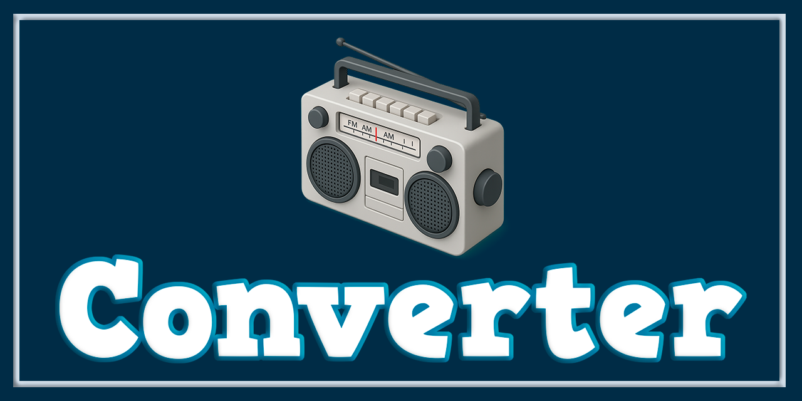

# 🎵 AudioConverter

AudioConverter es una aplicación de escritorio desarrollada en **C# (.NET / WinForms)** que permite convertir archivos de audio de forma **rápida, segura y profesional**, utilizando **FFmpeg embebido** y una arquitectura moderna orientada a jobs.

El proyecto está diseñado como una herramienta **robusta para uso real**, con soporte de **batch conversion**, **progreso real**, **cancelación por archivo** y **cancelación global**, manteniendo una experiencia de usuario clara y fluida.

---


---



---

## ✨ Características principales

* 🔁 **Conversión por lotes (Batch)** de múltiples archivos
* 📊 **Progreso real por archivo** usando `-progress pipe:1` de FFmpeg
* ⛔ **Cancelación individual y global** sin procesos zombies
* 🎚️ Configuración de:

  * Frecuencia de muestreo
  * Canales (Mono / Stereo)
  * Profundidad de bits
  * Formato de salida
* 🎧 Formatos soportados:

  * WAV
  * MP3
  * FLAC
* 🧠 Arquitectura desacoplada (UI / Core / Runner)
* 🖥️ Interfaz moderna y clara (WinForms personalizado)
* 📦 FFmpeg **embebido** (no requiere instalación externa)

---

## 🖼️ Interfaz

La aplicación cuenta con una interfaz limpia y profesional:

* Título destacado
* Controles de conversión claramente separados
* Tabla con:

  * Archivo
  * Progreso
  * Estado
  * Botón Cancelar por archivo
* Bloqueo inteligente de UI durante conversiones

---

## 🧱 Arquitectura del proyecto

```
AudioConverter
│
├── Core
│   ├── Converter.cs        # Lógica de batch, estados y jobs
│   └── FFmpegRunner.cs     # Ejecución de FFmpeg, progreso y cancelación
│
├── Models
│   ├── ConversionJob.cs
│   ├── ConversionOptions.cs
│   └── ConversionStatus.cs
│
├── Helpers
│   └── Logger.cs
│
├── UI (WinForms)
│   ├── Form1.cs
│   ├── DataGridViewProgressColumn.cs
│   └── CustomMessageBoxForm.cs
│
└── FFmpeg
    └── ffmpeg.exe (embebido como recurso)
```

---
---

## 📷 Capturas de pantalla

<p align="center">
  
</p>

---

## 🔄 Flujo de conversión

1. El usuario añade archivos de audio
2. Se crean `ConversionJob` independientes
3. Cada job obtiene su duración real
4. FFmpeg se ejecuta con `-progress pipe:1`
5. El progreso se calcula en tiempo real
6. El usuario puede cancelar:

   * Un archivo individual
   * Todo el batch

---

## ⛔ Sistema de cancelación

La cancelación está implementada de forma **segura y correcta**:

* `CancellationTokenSource` por job
* Token global para batch
* Kill del proceso FFmpeg y su árbol (`process.Kill(true)`)
* Limpieza de recursos
* Estados claros (`Cancelled`, `Completed`, `Failed`)

No quedan procesos en segundo plano.

---

## 📊 Progreso real

El progreso **NO es simulado**.

Se calcula a partir de:

* Duración total real del archivo
* Tiempo procesado reportado por FFmpeg (`out_time`)
* Conversión a porcentaje exacto

Esto garantiza una barra de progreso **precisa y confiable**.

---

## 🛠️ Requisitos

* Windows 10 / 11
* .NET Desktop Runtime (compatible con WinForms)
* No requiere FFmpeg instalado

---

## 🚀 Ejecución

### Opción 1: Ejecutable

Descarga el ejecutable desde la sección **Releases** del repositorio:

1. Descarga el `.zip`
2. Extrae el contenido
3. Ejecuta `AudioConverter.exe`

### Opción 2: Compilación manual

```bash
git clone https://github.com/Pablitus666/Audio-Converter.git
```

Abrir la solución `AudioConverter.sln` en Visual Studio y compilar.

---

## 📦 Estado del proyecto

✔️ Estable
✔️ Listo para uso real
✔️ Arquitectura escalable

---

## 🔮 Posibles mejoras futuras

* ETA / tiempo restante por archivo
* Soporte para más formatos
* Perfil de calidad avanzado
* Migración a WPF
* Cola persistente

---

## 📄 Licencia

Este proyecto se distribuye bajo la licencia **MIT**.

---

## 🤝 Contribuciones

Las contribuciones, sugerencias y mejoras son bienvenidas.  
Si encuentras un problema o tienes una idea, no dudes en abrir un *issue* o *pull request*.

---

## 👨‍💻 Autor

Proyecto creado con enfoque en **calidad, estabilidad y buenas prácticas**.

*   **Nombre:** Pablo Téllez
*   **Contacto:** pharmakoz@gmail.com

---